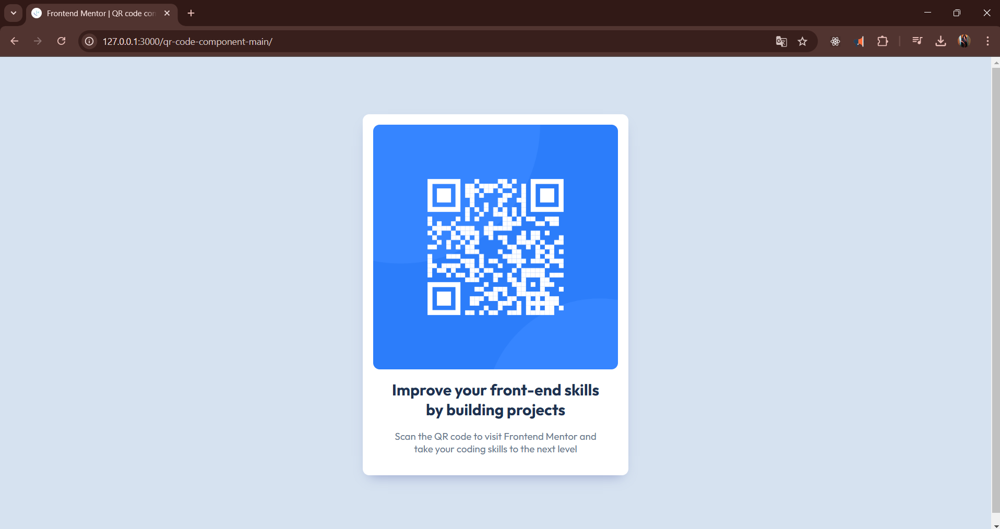

# Frontend Mentor - QR code component solution

This is a solution to the [QR code component challenge on Frontend Mentor](https://www.frontendmentor.io/challenges/qr-code-component-iux_sIO_H).

## Table of contents

- [Overview](#overview)
  - [Screenshot](#screenshot)
  - [Links](#links)
- [My process](#my-process)
  - [Built with](#built-with)
  - [Continued development](#continued-development)
- [Author](#author)
- [Acknowledgments](#acknowledgments)

## Overview

### Screenshot

### Links

- Solution URL: [GitHub](https://github.com/AlejandroIMP/qr-component-frontend)
- Live Site URL: [QR Component](https://qr-component-frontend-imp.netlify.app/)

## My process

### Built with

- Semantic HTML5 markup
- CSS custom properties
- Flexbox

### What I learned

I learned about semantic HTML and CSS with flexbox

## Author

- Frontend Mentor - [@AlejandroIMP](https://www.frontendmentor.io/profile/AlejandroIMP)
- Twitter - [@AlejandroRTW](https://x.com/AlejandroRtw)
